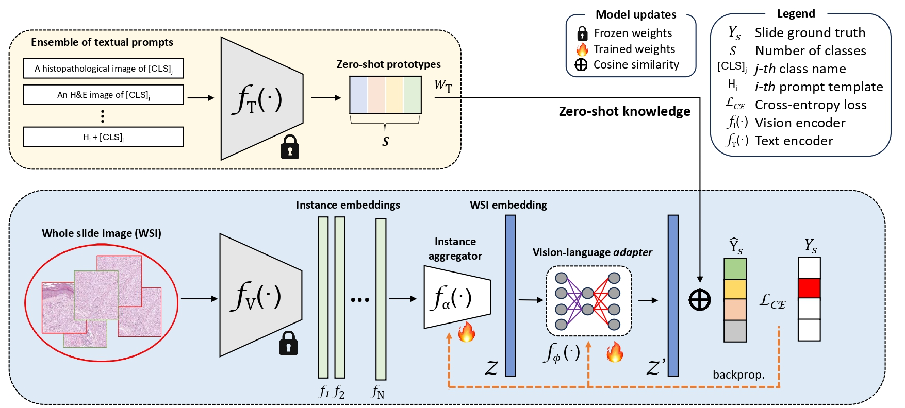

# MIL-Adapter 




[MedIA'26] [MIL-Adapter: Coupling multiple instance learning and vision-language adapters for few-shot slide-level classification
](https://doi.org/10.1016/j.media.2026.103964)

_Authors_: [Pablo Meseguer<sup>1</sup>](https://scholar.google.es/citations?user=4r9lgdAAAAAJ&hl=es&oi=ao), [Rocío del Amor<sup>1,2</sup>](https://scholar.google.es/citations?user=CPCZPNkAAAAJ&hl=es&oi=ao), [Valery Naranjo<sup>1,2</sup>](https://scholar.google.com/citations?user=jk4XsG0AAAAJ&hl=es&oi=ao) \
_Journal_: Medical Image Analysis ([MedIA](https://www.sciencedirect.com/journal/medical-image-analysis))  

<sup>1</sup>[Universitat Politècnica de València (UPV)](https://www.upv.es/)  
<sup>2</sup>[Artikode Intelligence SL](https://www.artikode.com/)

### Install MIL-Adapter

Clone repository and intall a compatible torch version with your GPU and required libraries.

```
git clone https://github.com/cvblab/MIL-Adapter.git
cd MIL-Adapter
pip install torch==2.1.0 torchvision==0.16.0 torchaudio==2.1.0 --index-url https://download.pytorch.org/whl/cu121
pip install -r requirements.txt
```

# Usage

### Data downloading

From [this link](https://upvedues-my.sharepoint.com/:f:/g/personal/pabmees_upv_edu_es/IgBmLFzeVUe4S5DDhKFQdpxdAaxAh07Gg_OV3L-w6VsZzcg?e=hsUmxr), you can manually download the files including the embeddings extracted with the corresponding foundation model. Each `.npy` file contain `N*d` array, where `N` denotes the number of patches in the slide and `d` the dimension of the patch-level features. The `folder` argument should point to the path containing the subfolder `<project>\<encoder>`.

### Few-shot weakly-supervised WSI classification 

The impact of classifier initialization in Multiple Instance Learning (MIL) frameworks have been considerably understudied, specially in few-shot learning scenarios where it exists a higher risk of overfitting. You can investigate the performance of different MIL models with randomly initialized classifiers running the following execution. 

```
python main.py --folder <folder> --project NSCLC --encoder CONCH --aggregator ABMIL --adapter ZSMIL --init random --k_shots 4
```

Note that the `--init` argument determines if the classification layer is initialized randomly or following the zero-shot (ZS) prototypes. Different choices for the `--aggregator` and `--encoder` parameters are provided in the argument parser code.

### MIL-Adapter

Vision-language models (VLM) offer the oportunity to leverage prior information about the classification task by using natural language and the VLM text encoders. We rely on textual ensemble learning to reduce prompt dependence and innovately combine VL-adapter for the MIL paradigm.

```
python main.py --folder <folder> --project NSCLC --encoder CONCH --aggregator ABMIL --adapter TaskRes --init ZS --k_shots 4
```

Note that all adapters are initialized with the text prototypes using `--init ZS`. Different choices for the `--adapter` parameter are provided in the argument parser code.

## To-do list

- [ ] Provide code to encode text prototypes with textual ensemble learning.
- [ ] Provide code to perform weakly-supervised zero-shot classification.

# Citation
If you find this work and repository useful, please consider citing this paper:


```
@article{MESEGUER2026103964,
title = {MIL-Adapter: Coupling multiple instance learning and vision-language adapters for few-shot slide-level classification},
journal = {Medical Image Analysis},
pages = {103964},
year = {2026},
issn = {1361-8415},
doi = {https://doi.org/10.1016/j.media.2026.103964},
url = {https://www.sciencedirect.com/science/article/pii/S1361841526000332},
}
```


